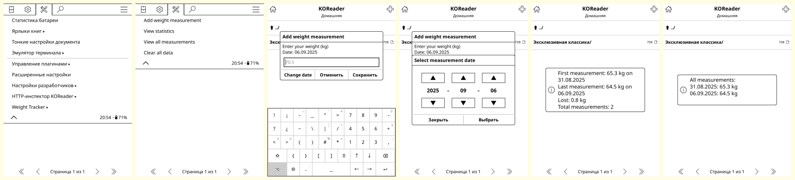

# weighttracker.koplugin

Tiny KOReader plugin for tracking weight measurements

## Functions
- **Adding measurements** - Entering weight with the ability to select the measurement date.
- **Viewing statistics** - Basic information about weight dynamics: 
    - First and last measurement.
    - Weight change for the entire period.
    - Total number of measurements.
- **Viewing all measurements** - A complete list of records showing the last 20 measurements.
- **Clearing data** - Deleting all records.

## Installation

1.  Download the latest release.
2.  Copy the `weighttracker.koplugin` directory to the `koreader/plugins` folder on your device.
3.  Restart KOReader.